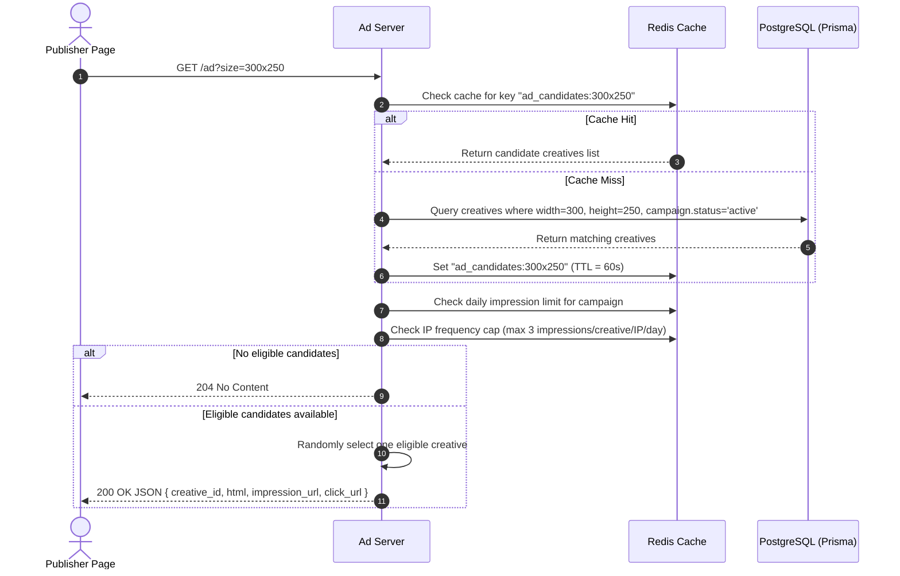
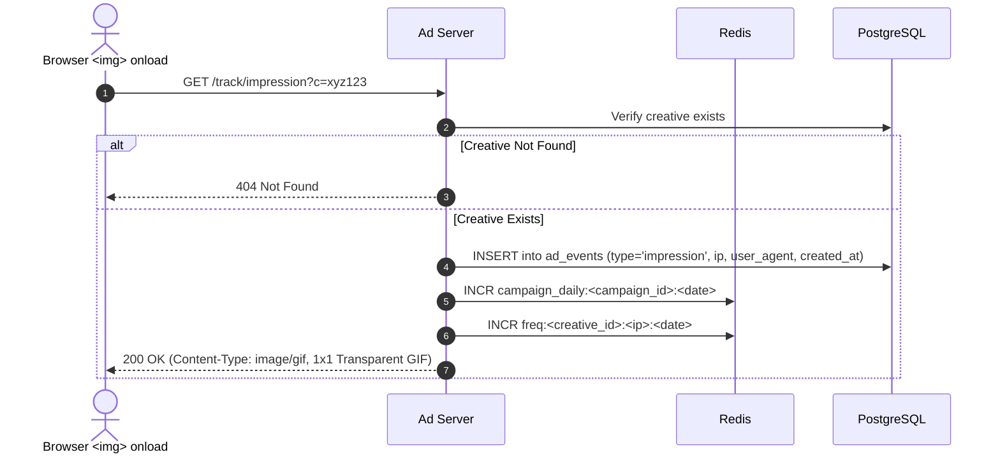
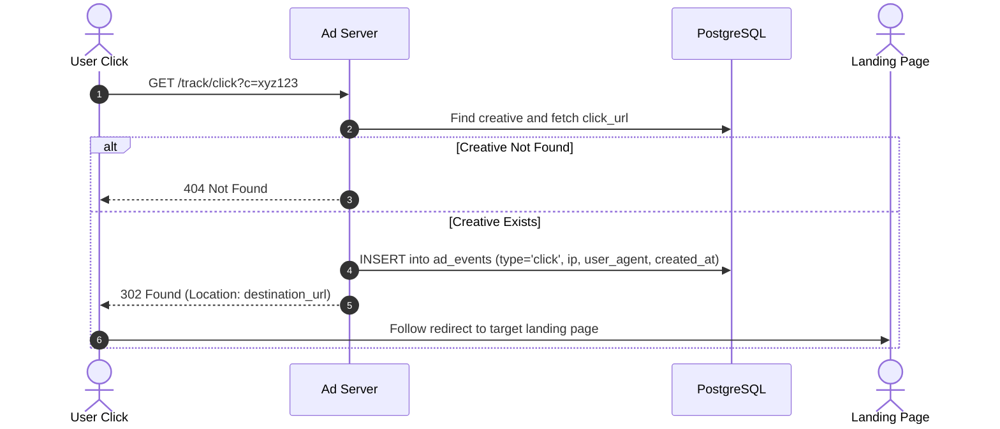
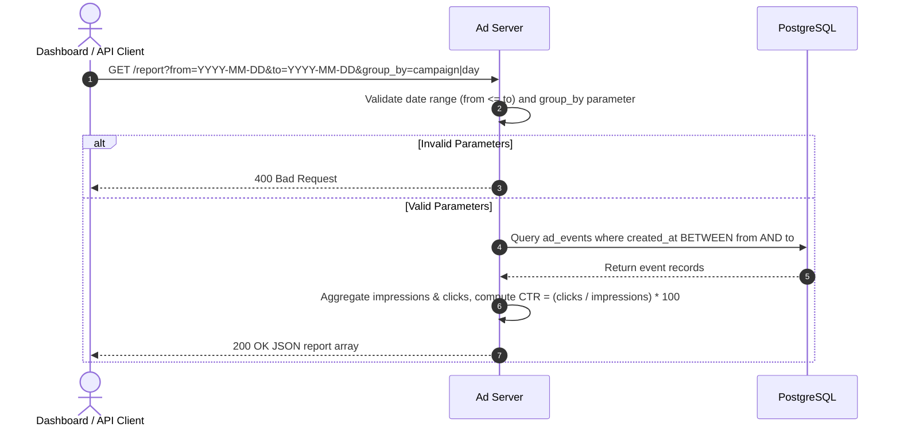

# Mini Ad Server

A high-performance ad-serving engine, tracking system, and analytics dashboard built with **Express.js**, **PostgreSQL (Prisma ORM)**, **Redis**, and a modern **Next.js 15 (Tailwind CSS)** control center.

---

## 🎯 Architecture Overview & Request Flow

The system coordinates between three primary layers:
1. **Ad Decision Engine (Express + Redis + PostgreSQL)**: Resolves ad requests in sub-milliseconds by querying candidate creatives cached in Redis, applying frequency caps and daily delivery limits, and returning formatted creative assets.
2. **Telemetry & Tracking Engine**: Ingests impression pixels (1x1 transparent GIFs) and click redirects (HTTP 302 to destination URLs), recording attribution events asynchronously into PostgreSQL and incrementing atomic counters in Redis.
3. **Publisher Interface & Management Dashboard**: A standalone publisher demo page (`publisher.html`) with embedded JavaScript ad tags alongside a Next.js management dashboard providing campaign CRUD, creative uploading, live ad simulation, and CTR reporting.

```
                    ┌────────────────────────────────────────────────────────┐
                    │                    Publisher Browser                   │
                    │   ┌──────────────────────┐  ┌───────────────────────┐  │
                    │   │ Ad Slot (300x250)    │  │ Ad Slot (728x90)      │  │
                    │   └──────────┬───────────┘  └───────────┬───────────┘  │
                    └──────────────┼──────────────────────────┼──────────────┘
                                   │                          │
                 1. GET /ad?size=...                          │ 1. GET /ad?size=...
                                   ▼                          ▼
                   ┌───────────────────────────────────────────────┐
                   │             Mini Ad Server (Express)          │
                   │    - Request size parsing & validation        │
                   │    - Campaign daily limit check               │
                   │    - IP frequency cap check (max 3/day)       │
                   └───────────┬──────────────────────┬────────────┘
                               │                      │
                  Cache Hit?   │                      │ Cache Miss?
                               ▼                      ▼
                    ┌──────────────────┐    ┌──────────────────┐
                    │      Redis       │    │    PostgreSQL    │
                    │  Candidate Pool  │    │     (Prisma)     │
                    │   (60s TTL)      │    │  Active Campaigns│
                    └──────────────────┘    └──────────────────┘
                               │
               2. Return JSON { creative_id, html, impression_url, click_url }
                               ▼
                    ┌──────────────────────┐
                    │  Render  asset  │
                    └──────────┬───────────┘
                               │
            On Image Load      │ On User Click
                               │
       3. GET /track/impression?c=...   4. GET /track/click?c=...
                               ▼                          ▼
               ┌───────────────────────┐  ┌───────────────────────┐
               │ Log Event in Postgres │  │ Log Event in Postgres │
               │ Return 1x1 GIF (200)  │  │ Return 302 Redirect   │
               └───────────────────────┘  └───────────────────────┘
```

### Request Flow Sequences

#### 1. Ad Request Flow (`GET /ad?size=300x250`)


#### 2. Impression Tracking Flow (`GET /track/impression?c=<creative_id>`)


#### 3. Click Tracking Flow (`GET /track/click?c=<creative_id>`)


#### 4. Analytics & Reporting Flow (`GET /report?from=...&to=...&group_by=...`)


---

## 🛠 Tech Stack

- **Backend**: Express.js, TypeScript, Winston Logger (Daily Rotate File), Morgan, Zod Validation, Request-IP, Colors
- **Database**: PostgreSQL 16 via Prisma ORM
- **In-Memory Cache**: Redis 7 (ioredis)
- **Frontend**: Next.js 15 (App Router), React 19, Tailwind CSS v4, Lucide Icons, Sonner Toasts, Server Actions (`nextFetch`)
- **Containers**: Docker & Docker Compose

---

## 🌟 Bonus Features Implemented

### 1. Redis Candidate Caching with TTL
- Candidate creatives for each requested dimension are cached in Redis under `ad_candidates:${width}x${height}` with a **60-second TTL**.
- On campaign or creative modification/deletion, the cache is instantly invalidated via `RedisHelper.invalidateAdCache()`.

### 2. IP Frequency Capping
- Delivery is capped at **no more than 3 impressions per creative per client IP per day**.
- Tracked via Redis atomic keys `freq:${creativeId}:${ip}:${YYYY-MM-DD}` with 24-hour expiration.

### 3. Daily Impression Limit Enforcement
- Respects the campaign's `daily_impression_limit` configuration.
- Real-time impressions are tracked atomically in Redis (`campaign_daily:${campaignId}:${YYYY-MM-DD}`).
- Once a campaign hits its daily threshold, the candidate filter skips it to avoid over-delivery.

---

## 📄 Demo Publisher Page (`publisher.html`)

Located at the repository root and also served directly at `http://localhost:5000/demo`:
- Features two responsive ad slots:
  - **300×250** (Medium Rectangle)
  - **728×90** (Leaderboard)
- Uses an embedded JavaScript "ad tag" snippet that:
  1. Requests `/ad?size=...` for each configured slot.
  2. Renders the returned creative wrapped in a tracking link pointing to `/track/click?c=...`.
  3. Listens for the creative image's `onload` event to count the impression.
  4. Guarantees that the impression fires **at most once per ad load**.
  5. Includes a real-time on-page telemetry log displaying requests, responses, and pixel triggers.

---

## 🚀 How to Run the Project

### Prerequisites
- Node.js (v18+)
- Docker & Docker Compose (or local PostgreSQL and Redis)

### Quick Start with Docker

1. **Clone the repository**:
   ```bash
   git clone <repo-url>
   cd mini-ad-server
   ```

2. **Start PostgreSQL and Redis**:
   ```bash
   docker compose up -d
   ```
   *PostgreSQL is exposed on port `5433` (to avoid conflict with default Windows 5432 services) and Redis on `6379`.*

3. **Backend Setup**:
   ```bash
   cd backend
   npm install
   npx prisma db push
   npm run seed
   npm run dev
   ```
   *The backend starts at `http://localhost:5000`.*
   - Database seeded with 3 realistic campaigns, 5 creatives (300x250 and 728x90), and 420 historical events for rich CTR reporting.
   - Publisher demo available at `http://localhost:5000/demo`.

4. **Frontend Setup** (in a separate terminal):
   ```bash
   cd frontend
   npm install
   npm run dev
   ```
   *The Next.js management dashboard starts at `http://localhost:3000`.*

---

## 📡 API Specification Reference

| Method | Endpoint | Description |
|---|---|---|
| `GET` | `/ad?size=300x250` | Returns `{ creative_id, html, impression_url, click_url }`. 204 if no match or capped. |
| `GET` | `/track/impression?c=<id>` | Records impression event and returns 1x1 transparent GIF (200). 404 for unknown creative. |
| `GET` | `/track/click?c=<id>` | Records click event and responds with HTTP 302 redirect to landing page. |
| `GET` | `/report?from=&to=&group_by=` | Returns impressions, clicks, CTR (%) grouped by `campaign` or `day`. 400 on invalid input. |
| `POST` | `/campaigns` | Creates campaign `{ name, daily_impression_limit, status }`. |
| `PATCH` | `/campaigns/:id` | Updates campaign (pause or resume by changing status). |
| `GET` | `/campaigns` | Lists all campaigns with creative and event counts. |
| `GET` | `/creatives` | Lists all creatives with dimensions and campaign association. |
| `POST` | `/creatives` | Adds a new creative banner to a campaign. |

---

## 💡 Assumptions & Future Improvements

### Assumptions Made
1. **IP Detection**: Standard `x-forwarded-for` and socket remote address fallback are used to determine client IPs for frequency capping.
2. **Date Boundaries**: Reporting date parameters (`from` and `to`) are evaluated inclusively between `00:00:00.000Z` and `23:59:59.999Z`.
3. **No Content (204)**: When all campaigns matching a size are paused, daily limits are exhausted, or frequency cap is triggered for the requester IP, HTTP 204 No Content is returned with an empty body.

### What Would Be Improved With More Time
1. **Asynchronous Telemetry Ingestion via Message Queue**: In high-load systems (10k+ QPS), buffering impression/click events in Redis Streams or Apache Kafka before batch-writing to PostgreSQL eliminates database write bottlenecks.
2. **Advanced Bidding & Targeting**: Geo-IP filtering, device/OS targeting, and eCPM/CTR-weighted campaign rotation rather than uniform random selection.
3. **Bot / Fraud Detection**: Filtering crawler user agents, deduplicating rapid accidental double-clicks within a debounce window, and validating referrer headers.
4. **Automated End-to-End Test Suite**: Comprehensive Jest/Supertest integration test suite asserting race-condition handling on daily limits and frequency caps.
